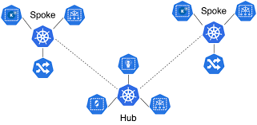

# Hub-Spoke Model Deployment on ArgoCD using EKS Clusters

## Table of Contents
- [Introduction](#introduction)
- [Prerequisites](#prerequisites)
- [Architecture Overview](#architecture-overview)
- [Creating EKS Clusters](#creating-eks-clusters)
- [Installing ArgoCD](#installing-argocd)
- [Configuring ArgoCD](#configuring-argocd)
- [Deploying Applications](#deploying-applications)
- [Monitoring and Managing Applications](#monitoring-and-managing-applications)
- [Automatic Syncing of Changes](#automatic-syncing-of-changes)
- [Conclusion](#conclusion)

## Introduction

The Hub-Spoke Model is a design pattern that organizes microservices into a central hub and multiple spokes. In this model, the hub serves as a central management point for resources, while the spokes represent isolated environments for applications. This README provides a comprehensive guide to deploying a Hub-Spoke Model using ArgoCD on Amazon EKS (Elastic Kubernetes Service).

## Prerequisites

Before proceeding, ensure you have the following:

- **AWS Account**: Access to create resources in AWS.
- **AWS CLI**: Installed and configured with appropriate permissions.
- **eksctl**: Installed for creating and managing EKS clusters easily.
- **kubectl**: Installed for managing Kubernetes clusters.
- **ArgoCD CLI**: Installed for interacting with ArgoCD.
- **Helm**: Installed for deploying applications.

## Architecture Overview

In this setup, we will create:
- A **Hub** cluster for centralized management and deployment of applications.
- **Spoke** clusters for isolated environments where applications will run.

### Diagram



## Creating EKS Clusters

### 1. Create Hub Cluster Using eksctl

Run the following command to create the Hub cluster using `eksctl`:

```bash
eksctl create cluster --name hub-cluster --region us-east-1
```

### 2. Create Spoke Clusters Using eksctl

Run the following command to create Spoke clusters:

```bash
eksctl create cluster --name spoke-cluster-1 --region us-east-1
eksctl create cluster --name spoke-cluster-2 --region us-east-1
```

## Installing ArgoCD

### 1. Configure kubectl for the Hub Cluster

Set the context for your Hub cluster:

```bash
aws eks update-kubeconfig --name hub-cluster --region us-east-1
```

### 2. Install ArgoCD

Run the following command to install ArgoCD in the `argocd` namespace:

```bash
kubectl create namespace argocd
kubectl apply -n argocd -f https://raw.githubusercontent.com/argoproj/argo-cd/stable/manifests/install.yaml
```

### 3. Expose the ArgoCD API Server Using NodePort

To access the ArgoCD API server using the NodePort method, run the following command:

```bash
kubectl expose service argocd-server --type NodePort --name argocd-server -n argocd
```

Retrieve the NodePort assigned to the service:

```bash
kubectl get service argocd-server -n argocd
```

### 4. Get the Node's External IP

You will need the external IP of the worker node where the service is running. Use the following command to get the node's external IP:

```bash
kubectl get nodes -o wide
```

## Configuring ArgoCD

### 1. Access the ArgoCD UI

Retrieve the initial admin password using the following command:

```bash
kubectl -n argocd get secret argocd-initial-admin-secret -o jsonpath="{.data.password}" | base64 -d; echo
```

Open the ArgoCD UI in your browser at `http://<external-node-ip>:<node-port>` and log in using the username `admin` and the retrieved password.

### 2. Configure Spoke Clusters

ArgoCD currently does not support adding clusters through the UI. To add the Spoke clusters, you must use the ArgoCD CLI.

#### 2.1. Set Context to Hub Cluster

Before adding the spoke clusters, make sure you're using the context of the Hub cluster:

```bash
kubectl config use-context <hub-cluster-context>
```

#### 2.2. Add Spoke Clusters Using the CLI

Use the following command to add a Spoke cluster to ArgoCD:

```bash
argocd cluster add <spoke-cluster-context>
```

- Replace `<spoke-cluster-context>` with the context name of your Spoke cluster, which can be found using:

```bash
kubectl config get-contexts
```

Repeat this command for any additional Spoke clusters you wish to add.

#### 2.3. Configure Cluster Access

Ensure that the service account used by ArgoCD has permissions to access the Spoke clusters. You may need to configure `kubectl` and apply the following command to grant permissions:

```bash
kubectl create clusterrolebinding argocd-cluster-admin \
  --clusterrole=cluster-admin \
  --serviceaccount=argocd:argocd-application-controller
```

## Deploying Applications
1. **Access the ArgoCD UI**:
   - Open your browser and navigate to `http://<external-node-ip>:<node-port>`.
   - Log in using the username `admin` and the password retrieved earlier.

2. **Create a New Application for Spoke Cluster 1**:
   - Click on the **"New App"** button on the ArgoCD dashboard.
   - **Application Name**: Enter a name for your application (e.g., `my-app-spoke-1`).
   - **Project**: Select `default` or another project if configured.
   - **Sync Policy**: Choose `Automatic`.

3. **Set the Source**:
   - **Repository URL**: Enter the URL of your GitHub repository (e.g., `https://github.com/atkaridarshan04/ArgoCD-Hub-Spoke-Model`).
   - **Revision**: Set to `HEAD`.
   - **Path**: Specify the path to your Kubernetes manifest within the repository (e.g., `k8s/nginx`).

4. **Set the Destination for Spoke Cluster 1**:
   - **Cluster**: Select `spoke-cluster-1`.
   - **Namespace**: Choose `default`.

5. **Create the Application**:
   - Click the **"Create"** button to create the application.

6. **Sync the Application**:
   - After the application is created, you will be redirected to the application details page. Click on the **"Sync"** button to deploy the application to Spoke Cluster 1.

7. **Create a New Application for Spoke Cluster 2**:
   - Repeat the above steps for Spoke Cluster 2, but change the **Application Name** to `my-app-spoke-2`.
   - In the **Set the Destination** step, select `spoke-cluster-2` instead of `spoke-cluster-1`.

## Monitoring and Managing Applications

- Monitor the application deployment status through the ArgoCD UI. The status will update as the application is deployed and synchronized with the specified GitHub repository.
- Use the CLI for managing and syncing applications:

   ```bash
   argocd app list
   argocd app sync my-app
   ```

## Automatic Syncing of Changes

1. **Make Changes in GitHub**:
   - Navigate to your GitHub repository and make any changes to the Kubernetes manifest files or application code.

2. **Automatic Sync**:
   - If you have configured the sync policy to `Automatic`, ArgoCD will automatically detect changes in the GitHub repository and deploy those changes to the specified spoke clusters without requiring manual intervention.
   - You can also manually sync the application if needed using the ArgoCD UI or CLI.

3. **Verify Changes**:
   - After making changes, monitor the deployment status in the ArgoCD UI to ensure that the new changes have been applied successfully.

## Conclusion

This README provided a detailed guide for deploying a Hub-Spoke Model using ArgoCD on EKS clusters. With ArgoCD, you can easily manage your applications across multiple environments, ensuring streamlined CI/CD workflows.

---